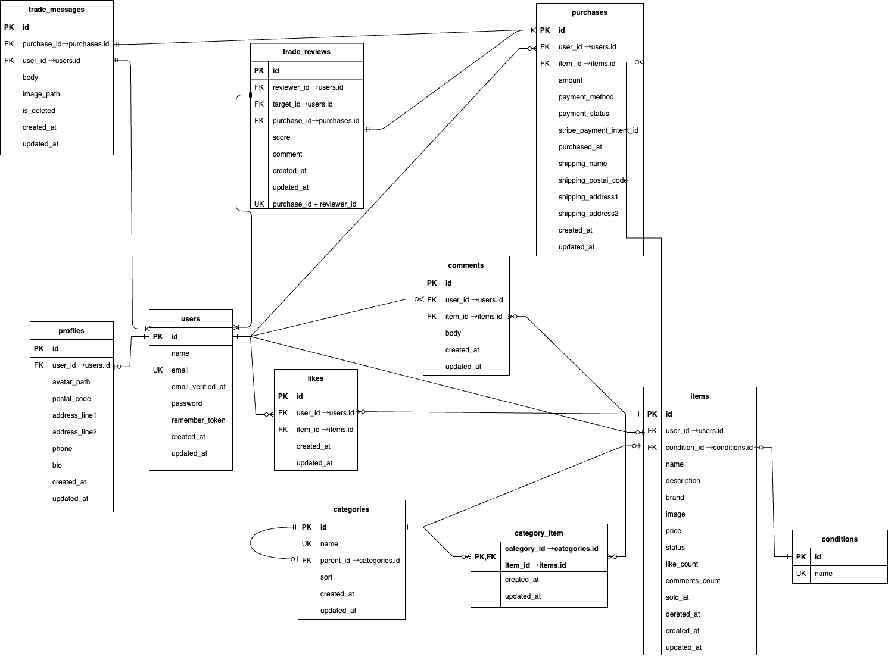

# coachtechフリマ

アイテムの出品・購入を行うためのWebアプリケーションです。
ユーザーはログイン後に商品を出品したり、他ユーザーの商品を購入・いいね・コメントすることができます。

---

## アプリケーション概要
- サービス名：**coachtechフリマ**
- サービス概要：出品・購入・いいね機能を備えたフリマアプリ
- 制作目的：LaravelおよびDocker環境でのWebアプリ開発実践
- 開発目標：初年度のユーザー数1,000人達成を想定
- 対象ユーザー：10〜30代の社会人
- 使用環境：PC（Chrome / Firefox / Safari 最新版対応）
- レスポンシブ対応：PC 幅 1400〜1540px、タブレット幅 768〜850px でレイアウトが崩れないように調整
---

## 主な機能
- ユーザー登録 / ログイン / ログアウト（Laravel Fortify使用）
- 商品一覧表示（おすすめ / マイリスト切替）
- 商品詳細表示・コメント投稿
- 商品出品（画像アップロード対応）
- いいね登録・解除機能
- 購入機能（住所変更・支払い方法選択）
- マイページ（購入履歴 / 出品履歴 / プロフィール編集）
- 取引チャット機能（出品者・購入者間のメッセージ / 画像送信）
- 取引中商品の未読メッセージ数表示（商品画像左上のバッジ / マイページのタブバッジ）
- 取引メッセージの編集・削除機能
- 取引完了後のユーザー評価機能（1〜5段階評価）
- プロフィール画面での取引評価平均の表示（小数点は四捨五入）
- 取引完了時のメール通知（MailHogで確認可能）

---

## 環境構築

### Dockerビルド
1. リポジトリのクローン
    ```bash
    git clone https://github.com/sametyan9999/laravel-furima.git
    cd laravel-furima
    ```

2. コンテナをビルド・起動
    ```bash
    docker compose up -d --build
    ```
※ MySQL が OS によって起動しない場合があるので、それぞれのPCに合わせて docker-compose.yml を編集してください。

### Laravel環境構築
1. PHPコンテナに入る
    ```bash
    docker compose exec php bash
    ```

2. 依存関係をインストール
    ```bash
    composer install
    ```

3. .env ファイルを作成
    ```bash
    cp .env.example .env
    ```
> ※ `.env` ファイルはプロジェクト直下（`laravel-furima/.env`）に作成してください。

4. `.env` の設定を修正（Docker用設定＋Stripe・MailHog設定）
```
# ======================
# 基本設定
# ======================
APP_ENV=local
APP_KEY=
APP_DEBUG=true
APP_URL=http://localhost

# ======================
# Database（Docker用）
# ======================
DB_CONNECTION=mysql
DB_HOST=mysql
DB_PORT=3306
DB_DATABASE=laravel_db
DB_USERNAME=laravel_user
DB_PASSWORD=laravel_pass

# ======================
# ファイルアップロード設定
# ======================
FILESYSTEM_DRIVER=public

# ======================
# メール設定（MailHog）
# ======================
MAIL_MAILER=smtp
MAIL_HOST=mailhog
MAIL_PORT=1025
MAIL_USERNAME=null
MAIL_PASSWORD=null
MAIL_ENCRYPTION=null
MAIL_FROM_ADDRESS="no-reply@example.com"
MAIL_FROM_NAME="COACHTECH FLEA"

# ======================
# その他
# ======================
QUEUE_CONNECTION=sync
SESSION_DRIVER=file
SESSION_LIFETIME=120

# ======================
# Stripe設定（各自のキーを設定してください）
# ======================
STRIPE_KEY=pk_test_******************************
STRIPE_SECRET=sk_test_******************************
```
---

**補足**
> - `.env` は開発者ごとに設定が異なります。クローン後は上記のように各自で設定してください。
> - `.env` は `.gitignore` により GitHub へアップロードされません。
> - Stripeキーは、Stripeダッシュボード → 開発者 → APIキー → テストモード から取得可能です。
> - MailHog は開発用のメールキャッチャーです。送信結果は [http://localhost:8025](http://localhost:8025) で確認できます。

---

**テストカード情報**
> - カード番号：`4000003920000003`
> - 有効期限：任意の未来日（例：12/30）
> - CVC：任意の3桁（例：123）
> - この番号を使うと実際に課金は発生せず、テスト決済が行えます。
> - 詳細は [Stripe公式ドキュメント](https://stripe.com/docs/testing#international-cards) を参照してください。

---

5. アプリケーションキーを生成
    ```bash
    php artisan key:generate
    ```

6. マイグレーションを実行
    ```bash
    php artisan migrate
    ```

7. シーディングを実行
    ```bash
    php artisan db:seed
    ```

※開発中に一度テーブルを全てリセットしてからデータを入れ直したい場合
```
php artisan migrate:fresh --seed
```

### Seeder内容

初期データには以下が含まれます：

- UsersSeeder：ダミーユーザー3件
  - 販売者A（sellerA@example.com）
  - 販売者B（sellerB@example.com）
  - 閲覧ユーザー（viewer@example.com）
- ProfilesSeeder：各ユーザーのプロフィール初期値
- ConditionsSeeder：商品状態マスタ
- CategoriesSeeder：カテゴリ14件
- ItemsSeeder：ダミー商品10件
  - 販売者Aが CO01〜CO05 を出品
  - 販売者Bが CO06〜CO10 を出品
- ItemsCategorySeeder：商品とカテゴリの紐付け

### ダミーユーザー情報

初期データとして、以下の 3 ユーザーが作成されます。

| 用途           | メールアドレス           | パスワード |
|----------------|-------------------------|-----------|
| 販売者A（CO01〜CO05 を出品） | `sellerA@example.com` | `password` |
| 販売者B（CO06〜CO10 を出品） | `sellerB@example.com` | `password` |
| 閲覧専用ユーザー（商品・取引に紐付けなし） | `viewer@example.com`   | `password` |

> ログイン画面から上記アカウントを利用することで、出品側・購入側・閲覧のみ それぞれの動作確認が行えます。

---

8. ストレージリンク作成（画像アップロード対応）
```
php artisan storage:link
```
storage/app/public に保存された商品・プロフィール画像を
http://localhost/storage/... で閲覧できるようにします。

---

## テスト実行方法
コンテナ内で以下を実行してテストを実施します。

1. PHP コンテナに入る
    ```bash
    docker compose exec php bash
    ```

2. コンテナ内でテストを実行
    ```bash
    php artisan test
    ```
---

## 決済処理フロー（Stripe）
本アプリでは、Stripeを利用した カード支払い と コンビニ支払い の2種類に対応しています。

 ### カード支払い
 - 支払い完了後、即座に「購入完了」画面へ遷移します。
 - 商品は即時に `sold` 状態へ更新され、一覧でも「Sold」バッジが表示されます。

 ### コンビニ支払い
 - Stripeが発行する支払い番号を使って、店頭（ローソン・ファミリーマートなど）で支払いを行います。
 - 入金完了後、Stripeの Webhook 通知によってシステムが商品を `sold` 状態へ更新します。
 - そのため、支払い直後はステータスがすぐには反映されません（非同期処理）。

---

## Stripe CLI（開発環境でのWebhook受信に必要）

StripeのWebhook通知をローカル環境で受信するためには、**Stripe CLI（公式ツール）** のインストールが必要です。
Stripe CLIを使用することで、Stripeのテストイベント（例：支払い成功）をローカル環境のLaravelアプリへ転送できます。

### インストール（Macの場合）
```bash
brew install stripe/stripe-cli/stripe
```
ログイン
```bash
stripe login
```
ブラウザが自動で開き、Stripeアカウントへの認証を求められます。
バージョン確認
```bash
stripe --version
```
stripe version 1.x.x と表示されればインストール完了です。
補足
	•	Stripe CLI は開発環境専用ツールです。本番環境では Stripe ダッシュボード上で Webhook URL を登録してください。
	•	CLIを終了するとWebhook受信も停止します。再開時は新しい whsec_xxx を .env に再設定する必要があります。
	•	Stripe CLIを使うと、コンビニ支払いなどの 非同期決済処理（Webhook連携） をローカルで再現できます。

---

## Webhook設定（開発環境）

開発環境では、Stripe CLIを使ってWebhookをローカルに転送します。
```bash
stripe listen --forward-to http://localhost/stripe/webhook
```
実行後に表示されるメッセージ：
```
Ready! Your webhook signing secret is whsec_xxxxxxxxxxxxx
```
この値を `.env` に設定します：
```
STRIPE_WEBHOOK_SECRET=whsec_xxxxxxxxxxxxx
```
設定後はキャッシュをクリア：
```bash
php artisan config:clear
```

---

## Webhookテスト（コンビニ入金の再現）
別ターミナルで以下を実行し、入金完了イベントを再現します
```bash
stripe trigger payment_intent.succeeded \
  --override payment_intent:metadata.item_id=1 \
  --override payment_intent:metadata.user_id=5
```
- `item_id`：販売中商品のID
- `user_id`：購入者ユーザーのID
※実際のDB値に置き換えてください。

実行後、DBまたは一覧画面で `sold` に更新されていることを確認できます。

💡 **補足**
- Stripe CLIを終了すると Webhook の受信も停止します。再開時は新しい Secret を `.env` に再設定してください。
- 本番環境では Stripe ダッシュボード上で正式な Webhook URL を登録します。
- Webhook リスニング中は Ctrl + C で停止可能です。

---

## 今回追加した主な機能（取引チャット関連）

COACHTECH Pro 入会テストの要件に合わせ、以下の機能を追加実装しました。

1. 取引チャット機能
   - 出品者・購入者間でのメッセージ送受信（テキスト / 画像）
   - メッセージの編集・論理削除

2. 取引中商品の一覧・未読バッジ
   - マイページ「取引中の商品」タブから、取引中の一覧を閲覧
   - 各取引につき、**自分の最後の投稿以降に届いた相手からのメッセージ件数** を商品画像左上に赤バッジで表示
   - タブ見出し「取引中の商品」の右側にも、全取引の未返信件数の合計を表示

3. 取引自動ソート
   - 取引メッセージの最新投稿日が新しい取引ほど、一覧やサイドバーの上部に表示

4. 取引後評価機能
   - 購入者・出品者が 1〜5 の星評価を送信可能
   - 評価後は商品一覧画面へ遷移

5. 取引完了メール
   - 購入者が初めて評価を送信したタイミングで取引を完了とみなし、
     出品者に「取引完了メール」を送信（MailHog で確認）

6. 評価平均表示
   - 各ユーザーは、受け取った取引評価の平均値をマイページのプロフィール欄で確認可能
   - 小数点は四捨五入で整数化し、★アイコンで表示

## 機能確認ガイド

ダミーユーザーを利用することで、以下の機能を簡単に確認できます。

## 取引関連機能

| 機能 | 画面 / URL | 確認方法 |
|------|------------|----------|
| **取引中商品の一覧表示（FN001）** | マイページ「取引中の商品」タブ `/mypage?view=trade` | 現在取引中の商品一覧が表示されます。<br>**購入者は自分が評価を送信した時点で、その取引は一覧から消えます。**<br>**出品者は自分が評価を送信するまで一覧に残ります。** |
| **取引メッセージ件数バッジ（FN005）** | マイページ「取引中の商品」タブ | 商品画像左上の赤バッジは **「自分の最後の投稿より後に、相手から送られたメッセージ数」** を表示します。タブ横には全取引の未返信件数合計を表示します。 |
| **取引チャット画面への遷移（FN002 / FN003）** | `/trade/{purchase}` | マイページの「取引中の商品」から遷移します。左側サイドバーで他の取引に切り替え可能です。 |
| **取引チャットの投稿 / 画像送信（FN006〜FN009）** | `/trade/{purchase}` | 画面下部フォームから本文・画像を送信できます。バリデーションエラー時は本文が保持されます（localStorage）。 |
| **メッセージ編集・削除（FN010 / FN011）** | `/trade/{purchase}` | 自分の投稿には「編集」「削除」が表示されます。削除時は「このメッセージは削除されました」と表示されます（論理削除）。 |
| **取引自動ソート（FN004）** | マイページ「取引中の商品」タブ / チャット画面サイドバー | **最後にメッセージが投稿された取引ほど上に表示されます。**（最新メッセージ日時の降順） |
| **評価モーダル表示（購入者）** | `/trade/{purchase}` | 購入者は右上の **「取引を完了する」** ボタン押下で評価モーダルが表示されます。送信すると購入者側では取引が終了し、一覧から消えます。 |
| **評価モーダル表示（出品者）** | `/trade/{purchase}` | **購入者が評価を送信すると、出品者宛に完了メールが届きます。**<br>出品者がチャットを開くと右上に **「取引を完了する」ボタン** が表示され、そこから出品者も評価できます（メール以外でも評価可能）。 |
| **評価平均の表示（US002 / FN005）** | `/mypage` プロフィール領域 | 自分が受け取った評価の平均値を★で表示します（四捨五入）。 |
| **完了メールの確認（FN015 / FN016）** | MailHog `/8025` | 購入者が評価を送信した瞬間、出品者宛に「取引完了メール」が送信されます。MailHog で確認できます。 |

---

## 環境情報（Docker構成）
| サービス | バージョン / イメージ | 備考 |
|-----------|----------------------|------|
| nginx | nginx:1.27-alpine | ARM対応 |
| php | php:8.1-fpm | Composer導入済 |
| mysql | mysql:8.4 | Docker永続化設定済 |
| phpMyAdmin | phpmyadmin/phpmyadmin:latest | 管理用GUI |
| mailhog | mailhog/mailhog:v1.0.1 | 開発用メール確認ツール（http://localhost:8025） |

---

## 使用技術(実行環境)

| 分類 | 技術・ライブラリ |
|------|----------------|
| 言語 | PHP 8.1.x |
| フレームワーク | Laravel 8.75+ |
| 認証 | Laravel Fortify / Laravel Sanctum |
| データベース | MySQL 8.4 |
| 決済 | Stripe PHP 18.x |
| フロントエンド | Blade / jQuery 3.7.1 |
| インフラ | Docker / Docker Compose |
| テスト | PHPUnit 9.5 |
| 管理ツール | phpMyAdmin / MailHog |
| バージョン管理 | Git / GitHub |

> **補足**
> - メールは MailHog に送信されます（開発用URL: [http://localhost:8025](http://localhost:8025)）。
> - Stripe は **テストキー** で動作します。

---

## ER図


---

## アプリケーションURL
| 環境 | URL |
|------|------|
| 開発環境 | [http://localhost](http://localhost) |
| phpMyAdmin | [http://localhost:8080](http://localhost:8080) |
| MailHog | [http://localhost:8025](http://localhost:8025) |
| ユーザー登録 | [http://localhost/register](http://localhost/register) |
| ログイン | [http://localhost/login](http://localhost/login) |

© 2025 coachtechフリマ